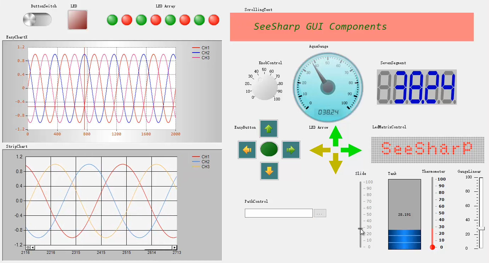

&ensp;&ensp;***This open source repository is developed and maintained by the JYTEK company, Shanghai, China, for the purpose of facilitating the development of the test and measurement using C# programming language. The project follows the GNU GPL V3.0 license and provides many commonly used T&M GUIs, utilities, data manipulations, and algorithms.***

# SeeSharpTools Introduction

&ensp;&ensp;SeeSharpTools is a collection of open source .NET libraries provided by JYTEK. It helps developers build T&M(Test and Measurement) applications based on .NET C# language in an easier and more efficient way. SeeSharpTools includes seventeen **dll** files(dynamic link library) and all the introductions of these libraies are listed below:

| Library                | Introduction                                                             |
|-------------------------|--------------------------------------------------------------------------|
| SeeSharpTools.JY.ArrayUtility       | Functions including array calculation and array Manipulation      |
| SeeSharpTools.JY.DSP.Fundamental    | Waveform generation and spectrum algorithms                       |
| SeeSharpTools.JY.DSP.FilterMCR      | Filter functions based on matlab runtime engine(MCR)              |
| SeeSharpTools.JY.DSP.SoundVibration | Algorithms for Sound and Vibration usage                          |
| SeeSharpTools.JY.DSP.Utility        | Common DSP algorithms                                             |
| SeeSharpTools.JY.DSP.Utility.Fundamental| Beta version of fundmental dsp algorithms                     |
| SeeSharpTools.JY.Statistics         | Statistic algorithms                                              |
| SeeSharpTools.JY.GUI                | Common winform GUI controls for Test and Measurement industries   |
| SeeSharpTools.JY.Graph3D            | 3D data visualization winfrom GUI controls                        |
| SeeSharpTools.JY.Localization       | Winform application UI localization                               |
| SeeSharpTools.JY.File               | File IO operation (csv/bin/wvf)                                   |
| SeeSharpTools.JY.Report             | Report and Log components                                         |
| SeeSharpTools.JY.ThreadSafeQueue    | Thread-safe queue functions                                       |
| SeeSharpTools.JY.Sensors            | Sensor value convert functions                                    |
| SeeSharpTools.JY.TCP                | TCP communication library                                         |
| SeeSharpTools.JY.Database           | Database operating utilities                                      |
| SeeSharpTools.JY.Mathematics        | Common used mathematic algorithms for array data.                 |
| SeeSharpTools.JY.Audio(Obsoleted)   | Audio-related waveform generation and related algorithms(Beta)    |

&ensp;&ensp;For more detail about these libraries, please check "SeeSharpTools User Mannual" located at repository gitpage: [https://seesharpopensource.github.io/SeeSharpTools/](https://seesharpopensource.github.io/SeeSharpTools/). Developers can get the latest release of SeeSharpTools and other software dependencies from JYTEK weibsite: [http://www.jytek.com/seesharptools](http://www.jytek.com/seesharptools).

***
# Library Introductions
---
### SeeSharpTools.JY.ArrayUtility

This library contains some common functions used for array calculation and array manipulation. The classes in this library is listed below:

- **ArrayCalculation:** *[static class]* provides array calculation algorithms including: array add/substract/multiply, array offset calculation, basic statistic algorithms like rms/average/sum/abs.
- **ArrayManipulation:** *[static class]* provides array manipulation utilities including: array subset, array replacement, two-dimension array transpose and etc.

---
### SeeSharpTools.JY.DSP.Fundamental

This library provides waveform generation function and basic DSP algorithms. The classes in this library is listed below:

- **Generation:** *[static class]* Provides waveform data generation function including: sine wave generation, square wave generation, uniform white noise generation and ramp wave generation.
- **Spectrum:** *[static class]* Provides spectrum calculation algorithm.*This algorithm is based on MKL. MKL should be installed before using Spectrum function. Developers can get the mkl installer from [JYTEK website](http://www.jytek.com/seesharptools).*

---
### SeeSharpTools.JY.DSP.FilterMCR
This library provides common filter functions based on MCR(Matlab compiler runtime). Developer need to install **'MCR(Matlab compiler runtime R2017a)'** before using this library. The classes in this library is listed below:

- **IIRFilter:** Provides IIR(Infinite Impulse Response) Filter functions including: Low-pass filter, High-pass filter, Band-pass filter, Band-stop filter.
- **FIRFilter:** Provides FIR(Finite Impulse Response) Filter functions including: Low-pass filter, High-pass filter, Band-pass filter, Band-stop filter and Kaiser Window filter.
- **JYSpectrum:** *[static class]* Provides Spectrum calculation algorithm.

---
### SeeSharpTools.JY.DSP.SoundVibration
This library provides some audio analyzing algorithms. Some of these algorithms are based on 'SeeSharpTools.JY.DSP.Fundamental'. The classes in this library is listed below:

- **HarmonicAnalyzer:** *[static class]* Provides THD and fundmental frequency calculation algorithm.

### SeeSharpTools.JY.DSP.Utility
This library provides some useful DSP algorithms. Some of these algorithms are based on 'SeeSharpTools.JY.DSP.Fundamental'. The classes in this library is listed below:

- **HarmonicAnalysis:** *[static calss]* Provides harmonic related parameters calculation including THD, THD+N, SNR, SNRAD, NoiseFloor, ENOB and etc.
- **PeakSpectrum:** *[static class]* Provides waveform peak Frequency and peak amplitude calculation algorithms.
- **Phase:** *[static class]* Provides Phase shift calculation algorithm between two related waveform.
- **SignlaProcessing:** *[static class]* Provides common data-validating functions and interpolation algorithms.
- **SquarewaveMeasurements:** *[static class]* Provides common sqaure wave measurement algorithms.
- **Synchronizer:** *[static class]* Provides function to synchronize the data for asynchronized data acquisition.
- **PeakValleyAnalysis** *[static class]* Provides peak and valley detection algorithms. This function is based on matlab runtime engine and a **MCR** should be installed when using this class.

---
### SeeSharpTools.JY.DSP.Utility.Fundamental
This library provides some cross-platform DSP algorithms. The classes in this library is listed below:

- **Spectrum:** *[static class]* Provides cross-platform Spectrum calculation algorithms.

---
### SeeSharpTools.JY.Statistics
This library provides some statistic algorithms. This library supports acceleration based on Intel-IPP libraries. To enable the Intel-IPP functions, please place Intel IPP dlls under \NativeDLLs\intel64 for x64 platform and \NativeDLLs\ia32 for x86 platform in the bin folder and set the property "provider" to Intel IPP . The classes in this library is listed below:

- **Statistics:** *[static class]* Provides common statistic algorithms including: Maximum, Minimum, Mean, RMS, StandardDeviation, Variance, Skewness, Kurtosis, Histogram.

---
### SeeSharpTools.JY.GUI
This library provides some useful winform GUI controls for measurement and test industries. These GUI controls can be used in Windows and Linux environment（with MONO). The picture below shows the appearance of some controls. The display effect of all the controls are shown in "SeeSharpTools User Mannual".

The classes in this library is listed below:

- **AquaGauge:** Instrumental dashboard control used to show single analog value.
- **PressureGauge:** Instrumental dashboard control used to show single analog value.
- **Tank:** Value display control with tank style.
- **Thermometer** Value display control with thermometer appearance.
- **SevenSegment:** Value display control with standard seven-segment nixie tube style.
- **SegmentBright:** Digital tube style value display control with more configurable appearance.
- **ButtonSwitch:** Toggle switch control for boolean value input. This control support multiple display style.
- **IndustrySwitch:** Industry switch control for boolean value input. This control support multiple display style.
- **EasyButton:** Button control with preset images that more intuitive than original winform button. The preset images is configurable.
- **EasyChart(Obsoleted):** Data Visualization control based on MS Chart. Easy to use and capable of showing substantial data. Abandoned and no longer maintained.
- **EasyChartX:** New version of Data visualization control(EasyChart). The improvments including: Higher efficiency, Optimized interface, More configurabe parameters, User experience improvement.
- **StripChart:** History graph with scroll style.
- **Slide:** Slide control used for analog value input.
- **GaugeLinear:** Slide control with adaptive scale and better appearance.
- **KnobControl:** Knob control for analog value input.
- **LED:** LED light control for boolean value output. This control support multiple display style.
- **LedArrow:** LED light control with arrow style. This control support multiple display style.
- **LedMatrixControl:** Control for text display with dot array style.
- **JYArray:** Control array for array data display.
- **PathControl:** Directory selection or input control.
- **ScrollingText:** Text display control with special scrolling effect.
- **ViewController** Useful component to batch-change property for designated controls in winform panel. The control can switch property "Enable" and "Visible" for now.
- **StripChartX** New version of history graph control(StripChart) with Higher efficiency, Optimized interface, More configurabe parameters, User experience improvement.
- **ButtonSwitchArray** Control array for bool set value input.

---
### SeeSharpTools.JY.Graph3D
This library provides some 3D data visualization winform controls. The classes in this library is listed below:

- **SurfaceGraph:** 3D graph for matrix data visualization. Support 3D mode and intensity graph mode.

---
### SeeSharpTools.JY.Localization
This library provides GUI localization functions. The classes in this library is listed below:

- **Localization:** Provides localization functions for the controls in winform application.

---
### SeeSharpTools.JY.File
This library provides file IO function for array datas. The classes in this library is listed below:

- **AnalogWaveformFile:** Provides file IO function with *.wvf files. WVF file is a customized file type that can save multiple parameters of waveform data including: SampleRate, ChannelCount, Card Name and etc.
- **CsvHandler:** Provides file IO function with csv file. This class can help developers manipulate csv in a easier ways: It takes only one line of code to implement the data write and read with csv file.
- **BinHandler:** Provides file IO function with binary file. This class can help developers manipulate binary file in a easier ways: It takes only one line of code to implement the data write and read with binary file.
- **IniHandler:** Provides ini file read and write functions.

### SeeSharpTools.JY.Report
This library provides common report components. The classes in this library is listed below:

- **ExcelReport:** Provides report function by xlsx/xls file type.
- **WordReport:** Provides report function by docx/doc file type.
- **Logger:** *[static class]* Provides common log functions.

---
### SeeSharpTools.JY.ThreadSafeQueue
This library provides Thread-safe queue containers. The classes in this library is listed below:

- **ThreadSafeQueue:** Queue that store *reference* of object. All the elements are saved as object type. Developers need to convert the dequeue element to its true type before using.
- **CircularQueue:** Queue that store the value type data. Datas added to the queue will be fully copied. This is an template container that can support any value type except string. An exception will be raised when the datas to added exceed the capacity of the queue.

---
### SeeSharpTools.JY.Sensors
This library provides the data convert function for common sensors. The classes in this library is listed below:

- **DisplacementSensor:** Provides the data convert function for linear displacement transducer.
- **LoadCell:** Provides the data convert function for loadCell.
- **RTD:** Provides the data convert function for RTD.
- **Thermistor:** Provides the data convert function for Thermistor.
- **Thermocouple:** Provides the data convert function for Thermocouple.

---
### SeeSharpTools.JY.TCP
This library provides the data transfer function through TCP protocol. The classes in this library is listed below:

- **JYTCPServer:** TCP server classes for data transfer.
- **JYTCPClient:** TCP client classes for data transfer.

---
### SeeSharpTools.JY.Database
This library provides common database function for mainstream Database including: Mysql, SQL server, Access and etc. The classes in this library is listed below:

- **DbOperation:** Provides common database function like Add, Deletion, Modification for mainstream DataBase.

---
### SeeSharpTools.JY.Mathematics
This library provides common used mathematic algorithms for array data. Threee engines (Math.Net, MKL, IPP) can be used. When Math.Net is used, these functions can be used with no extra libraries except SeeSharpTools; When MKL or IPP is used, the MKL library or IPP library should be installed which you can get from JYTEK website. Each engines has different performance, and the detailed test result is listed in "SeeSharpTools User Mannual". The classes in this library is listed below:

- **ArrayArithmetics:** *[static class]* This class provides array arithmatical algorithms like Abisolute/Add/Subtract/Mulityply/Subtract calculation, trigonometric function, exponent/logarithm calculatoin and etc.
- **ArrayOperation:** *[static class]* This class provides common used array operation functions including Concatenate /Copy /GetSubset /Insert /Inverse /Transpose and etc.
- **Fitting:** *[static class]* This class provides common used fitting algorithms including linear fitting, exponential fitting, polynomial fitting.
- **Interpolation:** *[static class]* This class provides common used interpolation algorithms including: Cubic-Spline interpolation, Linear interpolation, Log-Linear interpolation, Polynomial interpolation, Step interpolation.
- **LinearAlgebra:** *[static class]* This class provides common used linear algebra algorithms including: dot calculation, norm calculation.
- **Statistics:** *[static class] This class provides common used statistic algorithms including: histogram calculation, Kurtosis calculation, Mean value calculation, Median value calculation, Percentile value calculation, RMS calculation, Skewness calculation, Standard Deviation calculation and Variance calculation.

---
### SeeSharpTools.JY.Audio(Obsoleted)
This library provides some audio test related functions like: Audio test waveform generation, Audio system performance evaluate algorithms and etc. *This is a beta version library as the unmanaged library referenced by this library alway crisis unexpectedly.*
