**目录**

1.  SeeSharpTools概要

    1.  SeeSharpTools介绍

SeeSharpTools软件是简仪科技锐视测控平台提供的免费软件组件，包含一系列类库(Class Library)，提供方便易用的信号生成、分析和显示功能，帮助您在锐视测控平台下快速搭建测试测量解决方案。SeeSharpTools软件组件的主要功能如下：

| **类库名**                | **功能概要**                               |
|---------------------------|--------------------------------------------|
| JY.ArrayUtility           | 提供常用数组运算和操作运算功能。           |
| JY.Audio                  | 提供音频测试时常用的波形生成功能和指标算法 |
| JY.DSP.Fundamental        | 提供常用波形生成和频谱计算功能             |
| JY.GUI                    | 提供测试测量常用控件及相关功能             |
| JY.Database               | 提供数据库常用功能                         |
| JY.Localization           | 提供对WinForms程序实现本地化功能           |
| JY.DSP.FilterMCR          | 提供基于Matlab的滤波器计算相关功能         |
| JY.DSP.SoundVibration     | 提供声音震动方面的算法功能                 |
| JY.DSP.Utility            | 提供常用的数据处理算法功能                 |
| JY.DSP.Utility.Fundmental | 提供常用的基本数字信号处理算法             |
| JY.Graph3D                | 提供3D图形功能                             |
| JY.File                   | 提供文件读写功能                           |
| JY.Report                 | 提供报表功能                               |
| JY.ThreadSafeQueue        | 提供一组线程安全的队列组件                 |
| JY.Sensors                | 提供一组传感器数据转换的组件               |
| JY.Statistics             | 提供统计计算的算法工具                     |
| JY.TCP                    | 提供一组通过网络Socket传输数据的功能接口   |

 关于SeeSharpTools的Q&A
-----------------------

>   Q：SeeSharpTools软件是否提供开发环境中的在线帮助文档?

>   A：是的，在开发环境中调用SeeSharpTools各类库提供的方法时，在线帮助会自动显示(如下图所示)。本文档的后续内容也会介绍SeeSharpTools各类库的详细功能。

>   Q：SeeSharpTools软件中是否包含更丰富的数字信号处理、文件读写等常用功能?

>   A：在锐视测控平台下简仪科技以例程源代码的方式提供更丰富的测试测量相关功能实现，详情请参看SeeSharpExamples例程集。另外，在锐视测控平台下，还有很多功能强大第三方的免费或开源类库，对于这些第三方类库的使用，简仪科技也是以例程和参考设计的方式提供的。

 SeeSharpTools类库详述
======================

SeeSharpTools类库中提供了一组测试测量常用组件，覆盖了界面设计控件、数组操作、信号处理、文件读写、数据库操作等功能。

 SeeSharpTools.JY.ArrayUtility类库
----------------------------------

JY.ArrayUtility包含2个静态类：ArrayCalculation和ArrayManipulation
，分别提供常用数组运算和操作功能，方法如下表所示：

| **ArrayCalculation类**                 |                                                                                                                                                  |
|----------------------------------------|--------------------------------------------------------------------------------------------------------------------------------------------------|
| **方法名**                             | **功能概要**                                                                                                                                     |
| Add Subtract Multiply                  | 两个等长一维数值数组之间逐个元素的加、减、乘运算。                                                                                               |
| AddOffset SubtractOffset MultiplyScale | 一维或二维数值数组与单一数值的加、减、乘运算。                                                                                                   |
| Zero                                   | 将一维或二维数值数组中所有元素的值置为零。                                                                                                       |
| Sum Average RMS Abs                    | 一维数值数组的和、平均值、均方根值、绝对值的计算。                                                                                               |
| AreEqual                               | 比较两个数值数组是否完全相同                                                                                                                     |
| **ArrayManipulation类**                |                                                                                                                                                  |
| **方法名**                             | **功能概要**                                                                                                                                     |
| GetArraySubset                         | 将一维数组a[]中从指定起始位置起的后续元素拷贝至一维数组b[]； 将二维数组a[,]的指定行或列拷贝至一维数组b[]；                                       |
| ReplaceArraySubset                     | 将一维数组a[]的所有元素拷贝至一维数组b[]中的指定位置，替换原有元素； 将一维数组a[]的所有元素拷贝至二维数组b[,]中的指定行或列，替换该行或列的元素 |
| Transpose                              | 二维数组行列转置，即将N行M列的数组转换为M行N列。                                                                                                 |

 SeeSharpTools.JY.DSP.Fundamental类库
-------------------------------------

JY.DSP.Fundamental包含2个静态类：Generation和Spectrum
，分别提供常用波形生成和频谱计算功能，方法如下表所示：

| **方法名**        | **功能概要**                                                                                                                            |
|-------------------|-----------------------------------------------------------------------------------------------------------------------------------------|
| **Generation类**  |                                                                                                                                         |
| SineWave          | 生成一个包含整数个周期的正弦波形，可设定正弦波的幅度、初始相位和周期数； 生成一个正弦波形，可设定正弦波的幅度、初始相位、频率和采样率。 |
| SquareWave        | 生成一个包含整数个周期的方波波形，可设定方波的幅度、占空比和周期数； 生成一个方波波形，可设定方波的幅度、占空比、频率和采样率。         |
| UniformWhiteNoise | 生成一个指定幅度的随机白噪声波形。                                                                                                      |
| Ramp              | 生成一个等差数列。                                                                                                                      |
| **Spectrum类**    |                                                                                                                                         |
| PowerSpectrum     | 计算输入时域信号的功率谱，可设定加窗类型和输出功率谱的单位；                                                                            |

**注意:在使用Spectrum类之前，需要安装JXDSPRuntimeMKL，JXDSPRuntimeMKL分为X64和X86两个版本，请根据windows系统来选择安装。**

 SeeSharpTools.JY.GUI类库
-------------------------

SeeSharpTools.JY.GUI类库目前包含22种测试测量领域中常用GUI控件。

### EasyChart

EasyChart是基于微软MSChart控件实现的自定义控件，封装了最常用的单通道或多通道连续波形、单通道或多通道离散波形显示功能，包含的属性和方法如下表所示，其使用范例参见SeeSharpExamples/Graphical User Interface/JYEasyChart Basics。(该控件的功能已完全由EasyChartX替代，后续不再更新)

| **属性**           |                                                       |
|--------------------|-------------------------------------------------------|
| **属性名称**       | **功能描述**                                          |
| LegendVisible      | 设定是否在Chart中显示图例，默认为True。               |
| Palette            | 设定一系列颜色，依次用于Chart中各通道波形的颜色显示。 |
| XAxisLogarithmic1  | 设定X轴是否采用对数显示，默认为False。                |
| YAxisLogarithmic1  | 设定Y轴是否采用对数显示，默认为False。                |
| EasyChartBackColor | 设定EasyChart外框颜色                                 |
| ChartAreaBackColor | 设定EasyChart绘图区颜色                               |
| LegendBackColor    | 设定Legend背景色                                      |
| SeriesNames        | 设定每条线在Legend中显示的名称                        |
| YAutoEnable        | 设定Y轴范围是否自动配置                               |
| AxisYMax           | 设定Y轴最大值                                         |
| AxisYMin           | 设定Y轴最小值                                         |
| **方法**           |                                                       |
| Plot               | 显示单通道或多通道连续波形、单通道或多通道离散波形。  |
| SaveAsCsv          | 保存当前图中的数据到Csv文件，有路径入参和无参两个重载 |
| SaveAsImage        | 保存当前图表到png文件，有路径入参和无参两个重载       |

**注1：该属性在运行时不可设置。该属性设为True之后，调用Plot方法时输入的相应数据必须大于零。**

在Windows窗体上放置EasyChart控件后，可以选中该EasyChart控件后在属性表格中对上述属性进行设置并查看其效果，除非特别说明，这些属性也可以在运行时设置。

EasyChart支持单通道或多通道的连续或离散波形显示。此处的连续波形是指波形上任意相邻的两个点在X轴上均有相同的间隔，通常用于时域采样波形或频谱显示，在调用Plot方法显示连续波形时，除了输入波形数据，还可设定X轴上的起始位置和间隔；而离散波形是指波形上的任意一个点，都由独立的一对x和y来确定其在Chart上的位置，在调用Plot方法显示离散波形时，必须输出等长的两个数组，一一对应为各点在Chart上的位置。详情可参看EasyChart的例程，下图是EasyChart例程的运行效果图，4个图分别对应单通道连续波形、多通道连续波形、单通道离散波形和多通道离散波形。

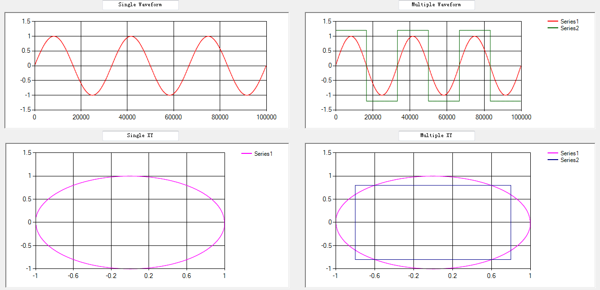

### AquaGauge

AquaGauge是一个仪表盘控件，用于显示数值，常用的属性如下图所示：

| **属性**             |                                              |
|----------------------|----------------------------------------------|
| **属性名称**         | **功能描述**                                 |
| BackColor            | 配置表盘背景颜色。                           |
| Glossiness           | 反光镜效果调试比例（0\<=&&\<=100的数值）     |
| Max                  | 表盘最大值                                   |
| Min                  | 表盘最小值                                   |
| TextDescription      | 表盘描述说明                                 |
| NumberOfDivisions    | 表盘分隔个数，数值范围（1\<=&&\<=25的数值）  |
| NumberOfSubDivisions | 表盘子分隔个数，数值范围（1\<&&\<=10的数值） |
| Value                | 表盘所显示的当前值                           |

控件显示效果如下图所示，使用的方法请参考配套范例：SeeSharpExamples/ Graphical User Interface/AquaGuageControlExample。

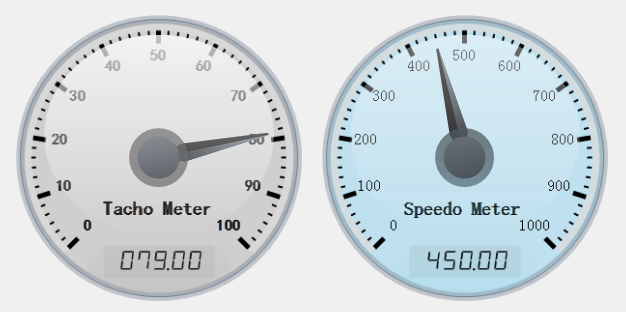

### PressureGauge

PressureGauge是一个压力表盘控件，功能类似于仪表盘，显示风格不同，该控件的常用属性如下表：

| **属性**             |                                              |
|----------------------|----------------------------------------------|
| **属性名称**         | **功能描述**                                 |
| BackColor            | 配置表盘背景颜色                             |
| BorderWidth          | 配置表盘边框厚度                             |
| Glossiness           | 反光镜效果调试比例（0\<=&&\<=100的数值）     |
| Max                  | 表盘最大值                                   |
| Min                  | 表盘最小值                                   |
| DescriptionText      | 表盘描述说明                                 |
| UnitText             | 表盘单位描述                                 |
| NumberOfDivisions    | 表盘分隔个数，数值范围（1\<=&&\<=25的数值）  |
| NumberOfSubDivisions | 表盘子分隔个数，数值范围（1\<&&\<=10的数值） |
| Value                | 表盘所显示的当前值                           |

控件的显示效果如下图所示，使用方法参见范例：SeeSharpExamples/ Graphical User Interface/PressureGaugeExample。

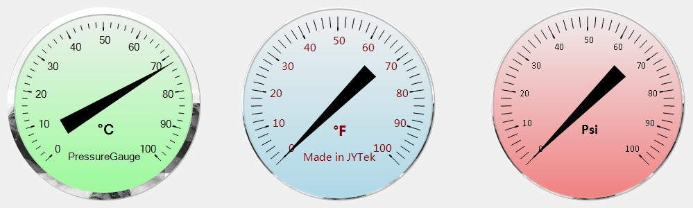

### Thermometer

Thermometer是一个温度计显示控件，可以用于显示温度等物理量。该控件常用属性如下表所示

| **属性**         |                                |
|------------------|--------------------------------|
| **属性名称**     | **功能描述**                   |
| LineWidth        | 配置温度计边界线宽             |
| LineColor        | 配置温度计显示的颜色           |
| ForeColor        | 配置温度计边界线的颜色         |
| TickColor        | 配置温度计刻度线颜色           |
| TickWidth        | 配置温度计刻度线线宽           |
| BallSize         | 配置温度计球的大小             |
| TextStyle        | 配置温度计刻度字体风格         |
| TickStyle        | 配置温度计刻度风格             |
| Value            | 配置温度计的显示值             |
| Min              | 配置温度计显示的最小值         |
| Max              | 配置温度计显示的最大值         |
| NumberOfDivision | 配置温度计刻度的个数           |
| TextDecimals     | 配置温度计刻度显示的小数点位数 |

控件的显示效果如下图，详细使用方法请参照配套范例：SeeSharpExamples/ Graphical User Interface/ThermometerExample。

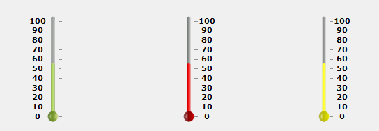

### KnobControl

KnobControl类是一个旋钮控件，该控件可以完成数值的输入操作。该控件的常用的属性方法如下表所示。

| **属性**          |                                                     |
|-------------------|-----------------------------------------------------|
| **属性名称**      | **功能描述**                                        |
| NumberOfDigits    | 数值显示时科学表达法的有效位数（0\<=&&\<=10的数值） |
| Max               | 旋钮最大值                                          |
| Min               | 旋钮最小值                                          |
| NumberOfDivisions | 旋钮分隔个数，数值范围（1\~25的数值）               |
| TickVisible       | Bool参数，是否显示旋钮数值                          |
| Value             | 旋钮所表示的当前值                                  |
| 事件              |                                                     |
| ValueChanged      | 默认事件。用户停止操作旋钮时触发。                  |
| ValueChanging     | 用户操作旋钮过程中触发。                            |

控件的显示效果如下图所示，使用方法参见SeeSharpExamples/ Graphical User Interface/KnobControlExamble。

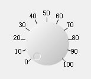

### Slide

Slide类是一个常用的滑杆控件，该控件可以完成数值的输入操作。控件的常用属性方法如下表所示。

| **属性**          |                                                     |
|-------------------|-----------------------------------------------------|
| **属性名称**      | **功能描述**                                        |
| NumberOfDigits    | 数值显示时科学表达法的有效位数（0\<=&&\<=10的数值） |
| Max               | 滑动杆最大值                                        |
| Min               | 滑动杆最小值                                        |
| NumberOfDivisions | 滑动杆分隔个数，数值范围（1\<=&&\<=25的数值）       |
| Orientation       | 滑动杆方向（Vertical，Horizontal）两种方向的选择    |
| TextStyle         | 滑动杆数值表示风格（None,TopLeft,BottomRight,Both） |
| ForeColor         | 滑动杆Tex颜色选择                                   |
| TickStyle         | 滑动杆Tick表示风格（None,TopLeft,BottomRight,Both） |
| TrickHeight       | 滑动杆Tick高度选择                                  |
| TrickColor        | 滑动杆Trick颜色选择                                 |
| TrackerColor      | 滑动块颜色选择                                      |
| TrackerSize       | 滑动杆滑块大小，如果with与Height相等，则会成为圆形  |
| LineColor         | 滑动杆主杆线颜色选择                                |
| LineWidth         | 滑动杆主杆线高度选择                                |
| Value             | 滑动杆所表示的当前值                                |
| 事件              |                                                     |
| ValueChanged      | 默认事件。用户操作滑杆后触发                        |
| ValueChanging     | 用户操作滑杆过程中触发                              |

控件的显示效果如下图所示，使用方法参见SeeSharpExamples/ Graphical User Interface/SildeControlExample。

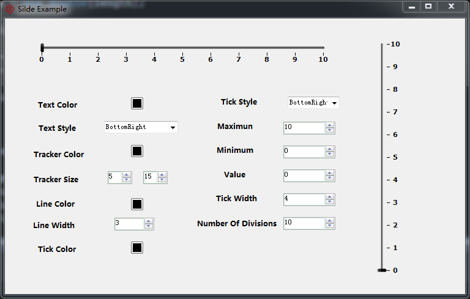

### Led

Led类是一个LED灯控件，该控件可完成bool数值的显示操作,控件常用的属性方法如下表所示：

| **属性**     |                                                 |
|--------------|-------------------------------------------------|
| **属性名称** | **功能描述**                                    |
| BlinkColor   | 灯闪烁的颜色                                    |
| BlinkInteral | 灯光闪烁时长，单位毫秒（100\<=&&\<=5000的数值） |
| BlinkOn      | Bool参数，是否打开闪烁功能                      |
| OffColor     | 灯光关闭时的颜色选择                            |
| OnColor      | 灯光打开时的颜色选择                            |
| Style        | LED样式选择，Circular,Rectangular               |
| Value        | Bool参数，灯光开闭选择                          |

控件的显示效果如下图所示。使用范例参见SeeSharpExamples/ Graphical User Interface/SwitchControlExample。

### EasyButton

EasyButton类是Button的一个衍生类，可以预设部分图片在控件上，增强Button的显示效果。该控件的相关属性如下表所示：

| **属性**     |                            |
|--------------|----------------------------|
| **属性名称** | **功能描述**               |
| PreSetImage  | 进行Button按钮图片预选功能 |

控件的显示效果如下图所示，使用范例参见SeeSharpExamples/ Graphical User Interface/SwitchControlExample

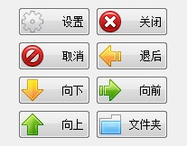

### IndustrySwitch

IndustrySwitch类是一个工业开关的控件类。控件的常用属性如下表所示，

| **属性**     |                        |
|--------------|------------------------|
| **属性名称** | **功能描述**           |
| Style        | 多种工业Switch复选功能 |
| Value        | 配置或获取当前控件的值 |
| **事件**     |                        |
| ValueChanged | 默认事件，值改变后触发 |

控件的显示效果如下图所示，使用方法参见范例SeeSharpExamples/ Graphical User Interface/SwitchControlExample。

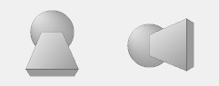

### ButtonSwitch

ButtonSwitch类是一个按钮开关的控件类，常用如下表所示。

| **属性**     |                          |
|--------------|--------------------------|
| **属性名称** | **功能描述**             |
| Style        | 多种Switch复选功能       |
| Value        | Bool参数，Switch开关选择 |
| 事件         |                          |
| ValueChanged | 默认事件，值改变事件     |

控件的显示效果如下图所示，使用的方法参见范例SeeSharpExamples/ Graphical User Interface/ButtonSwitchExample。

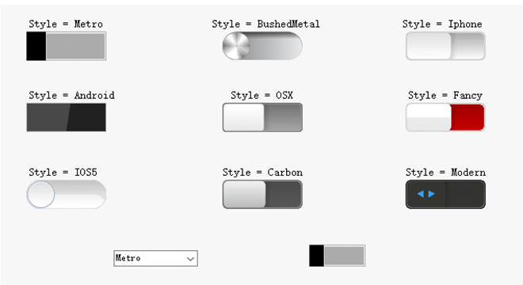

### Tank

Tank类是一个水罐样式的控件类，常用属性如下表所示：

| **属性**     |                                                                     |
|--------------|---------------------------------------------------------------------|
| **属性名称** | **功能描述**                                                        |
| BorderColor  | 边框颜色选择                                                        |
| BorderWidth  | 边框厚度选择                                                        |
| IsBright     | Bool参数，是否选用亮色显示Tank控件                                  |
| Maximun      | Tank数值最大值                                                      |
| Orientation  | Tank摆放方向                                                        |
| Styles       | Tank样式选择，Solid,Dashed                                          |
| TextColor    | Tank文本显示颜色选择                                                |
| TextStyle    | Tank文本显示样式选择（None,Percentage,Text,Value,ValueOverMaximum） |
| Value        | Tank所表示的当前值                                                  |

控件的使用效果如下图所示，使用方法参见范例：SeeSharpExamples/ Graphical User Interface/TankControlExample

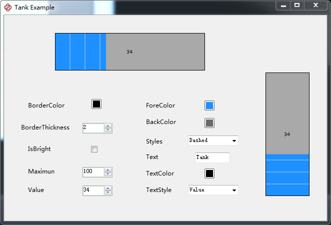

### ScrollingText

ScrollingText类是一个滚动显示字符串的控件，常用属性如下表所示：

| **属性**         |                                     |
|------------------|-------------------------------------|
| **属性名称**     | **功能描述**                        |
| BorderColor      | 边框颜色选择                        |
| BorderThickness  | 边框厚度选择                        |
| ScrollDirection  | 文本滚动方向选择                    |
| BorderVisible    | Bool参数，是否需要显示边框          |
| Text             | 滚动说明文本                        |
| SrollSpeed       | 滚动文本速度（1\<=&&\<=1000的数值） |
| VerticleAligment | 设置滚动条文字位置                  |

控件的显示效果如下图所示，使用方法参见范例：SeeSharpExamples/ Graphical User Interface/ScrollingTextExample。

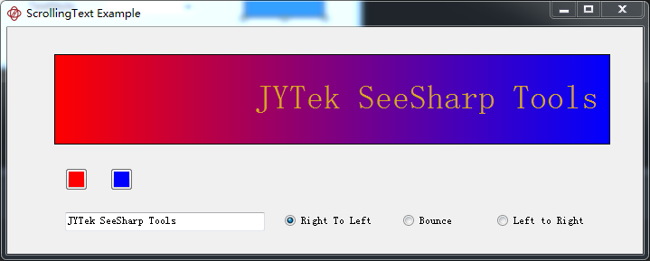

### SevenSegment

SevenSegment类是一个七段数码管控件类，常用属性如下表所示：

| **属性**     |                    |
|--------------|--------------------|
| **属性名称** | **功能描述**       |
| BackColor    | 背景颜色           |
| DarkColor    | 数码管暗时颜色     |
| LightColor   | 数码管亮时颜色     |
| DecimalShow  | 是否显示小数点位置 |
| ItalicFactor | 数码管倾斜系数     |
| NumberOfChar | 数码管总个数       |
| Value        | 数码管显示内容     |

控件的显示效果如下图所示，使用方法参见范例：SeeSharpExamples/ Graphical User Interface/SevenSegment。

### SegmentBright

SegmentBright类是一个七段数码管控件类，显示效果和SevenSegment不同，有更多的颜色选择。常用属性如下表所示：

| **属性**           |                                                        |
|--------------------|--------------------------------------------------------|
| **属性名称**       | **功能描述**                                           |
| BackColor1         | 背景颜色1                                              |
| BackColor2         | 背景颜色2 ，由背景颜色1与背景颜色2共同混合为新的背景色 |
| GradientBackground | 是否显示渐变背景色效果                                 |
| BorderColor        | 边框颜色                                               |
| BorderWith         | 边框宽度                                               |
| DarkColor          | 数码管不显示时颜色                                     |
| ForColor           | 数码管显示时的颜色选择                                 |
| HighlightOpaque    | 显示半透明颜色，默认值为50                             |
| NumberOfChar       | 数码管总个数                                           |

控件的显示效果如下图所示，使用方法参见范例SeeSharpExamples/ Graphical User Interface/SegmentBright。

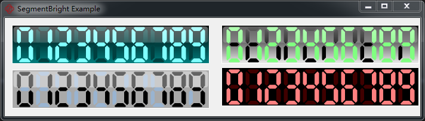

### LedMatrixControl

LedMatrixControl类是一个Led矩阵展示控件类，常用属性如下表所示：

| **属性**     |                                                          |
|--------------|----------------------------------------------------------|
| **属性名称** | **功能描述**                                             |
| LedOffColor  | 矩阵灯关闭颜色选择                                       |
| LedOnColor   | 矩阵灯打开颜色选择                                       |
| LedStyle     | 矩阵灯样式选择（circle,square）                          |
| LedRows      | Led矩阵灯的行数选择                                      |
| LedColumns   | Led矩阵灯的列数选择                                      |
| LedSizeCoeff | Led灯的大小比例系数（0\<=&&\<=1的数值）                  |
| Items        | Location 配置当前显示行Text的位置                        |
|              | Direction 配置当前显示行Text滚动方向(Up,Down,Left,Right) |
|              | Speed 配置当前显示行Text滚动速度                         |
| **方法**     |                                                          |
| StartMove    | 矩阵Led灯滚动开始                                        |
| StopMove     | 矩阵Led灯滚动停止                                        |

控件显示效果如下图所示，使用方法参见范例：SeeSharpExamples/ Graphical User Interface/LedMatrixControlExample。

### SwitchArray 和LEDArray

SwitchArray和LEDArray 使用了SeeSharpTools.GUI中IndustrySwith控件以及LED控件作为数组型态呈现。控件支持鼠标控制开关、程序变更数值（单一或数组类型），同时数值变更事件能够让用户界面注册使用。控件的显示效果如下图所示，使用方法参见范例：SeeSharpExamples/Graphical User Interface/JYGUIArrayExample。

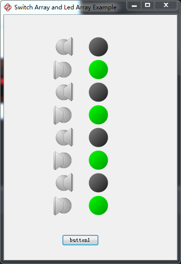

### JYArray

JYArray类提供二维数组显示界面，帮助测量数据呈现。控件支持数组累加呈现、变更列表名称、显示选取资讯、显示栏位号等功能。同时可使用属性提取全部资料。控件的显示效果如下图所示。

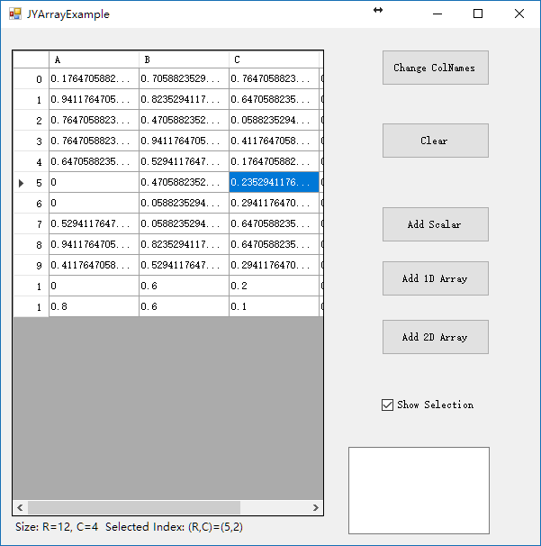

### PathControl

PathControl类是一个接收用户配置路径的控件类。PathControl提供四种输入模式，分别是浏览按钮、文字框输入、鼠标拖放以及程序输入。并可利用属性将路径读出供程序使用。该控件的显示效果如下图所示：

### StripChart

StripChart是基于微软MSChart控件实现的自定义控件，实现了单通道和多通道小型记录仪的功能。常用属性和方法如下

| **属性**           |                                                                        |
|--------------------|------------------------------------------------------------------------|
| **属性名称**       | **功能描述**                                                           |
| LegendVisible      | 设定是否在Chart中显示图例，默认为True。                                |
| Palette            | 设定一系列颜色，依次用于Chart中各通道波形的颜色显示。                  |
| YAxisLogarithmic   | 设定Y轴是否采用对数显示，默认为False。                                 |
| ChartBackColor     | 设定StripChart外框颜色                                                 |
| ChartAreaBackColor | 设定StripChart绘图区颜色                                               |
| MajorGridEnabled   | 设定是否使能主网格线                                                   |
| MinorGridEnabled   | 设定是否使能辅网格线                                                   |
| LineNum1           | 设定图中待显示的线数(Plot时会自动更新为真实线数)                       |
| LineWidth          | 设定每条线的线宽                                                       |
| SeriesNames        | 设定每条线在Legend中显示的名称                                         |
| YAutoEnable        | 设定Y轴范围是否自动配置                                                |
| AxisYMax           | 设定Y轴最大值                                                          |
| AxisYMin           | 设定Y轴最小值                                                          |
| Displaydirection   | 设置记录仪滚动的方向，可以从左向右或者从右向左                         |
| DisPlayPoints1     | 设置StripChart中每条线可以显示的最多点数，超过点数后绘图区开始滚动显示 |
| XAxisTypes         | X轴显示类型，可以是索引、时间戳、用户输入值。默认为索引。              |
| TimeStampFormat    | 设定时间戳的显示格式                                                   |
| NextTimeStamp      | 在时间戳模式下，配置或获取下一个时间戳                                 |
| TimeInterval       | 时间戳模式下，配置两个样点的时间差                                     |
| XAxisStartIndex    | 设定索引的开始数值                                                     |
| XAxisTitle         | X轴的标题                                                              |
| XTitlePosition     | X轴标题位置                                                            |
| XTitleOrientation  | X轴标题方向                                                            |
| YAxisTitle         | Y轴的标题                                                              |
| YTitlePosition     | Y轴标题位置                                                            |
| YTitleOrientation  | Y轴标题方向                                                            |
| ScrollType         | StripChart滚动模式                                                     |
| **方法**           |                                                                        |
| Plot               | 向StripChart的每条线写入多个点。                                       |
| PlotSingle         | 向StripChart的每条线写入一个点                                         |
| Clear              | 清空当前绘图                                                           |

**注1：有1标注的属性在运行时不可设置。该属性设为True之后，调用Plot方法时输入的相应数据必须大于零。**

在Windows窗体上放置StripChart控件后，可以选中该StripChart控件后在属性表格中对上述属性进行设置并查看其效果，除非特别说明，这些属性也可以在运行时设置。

StripChart支持单次写入每条线的多个点(Plot)或者每条线的单个点(PlotSingle)。写入后的点都将在StripChart中显示，当每条线写入的点数超过DisplayPoints配置的值时绘图区数值开始向左或向右滚动，保证单个绘图区每条线的点数不会超过DisplayPoints。DisplayPoints等于2000，总绘制点数为3000时StripChart的显示效果如下。控件的使用方法参见范例：SeeSharpExamples/Graphical User Interface/StripChartExamples。

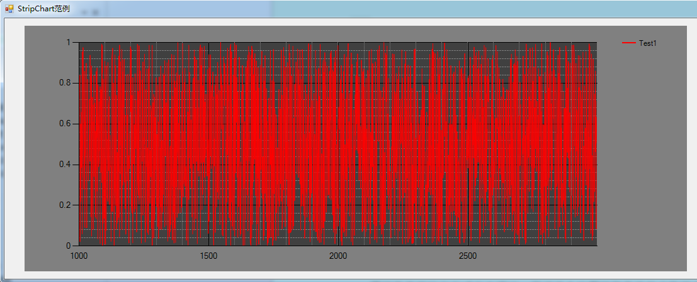

### GaugeLinear

GaugeLinear类是一个滑杆控件，该控件可实现数值的输入操作，同时该控件还支持设置数值滑杆/滑块/刻度的颜色，同时该控件的刻度会根据当前的空间大小自动匹配。控件常用的属性方法如下表所示。

| **属性**       |                                                              |
|----------------|--------------------------------------------------------------|
| **属性名称**   | **功能描述**                                                 |
| BackColor      | 配置控件的背景色                                             |
| Maximum        | 滑杆的最大值                                                 |
| Minimum        | 滑动杆最小值                                                 |
| Orientation    | 滑动杆方向（Vertical，Horizontal）两种方向的选择             |
| SlideDirection | 滑动杆数值递增方向（LeftToRight, RightToLeft）两种方向的选择 |
| Value          | 配置或获取滑块位置对应的数值                                 |
| **事件名称**   | **事件描述**                                                 |
| ValueChanged   | 控件的值被修改时触发                                         |

控件的显示效果效果如下图所示，使用方法参见范例：SeeSharpExamples/ Graphical User
Interface/GaugeLinearExample。

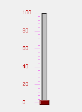

### EasyChartX

EasyChartX是基于微软MSChart控件实现的自定义控件，该控件是EasyChart的升级版本。EasyChartX中加入了测试测量很多常用的特性、尽量简化了对外接口、提高了绘图效率，同时新增分区视图，可以将每条线独立显示到不同的绘图区中。EasyChartX的属性、事件和方法如下表所示：

| **属性**                                                                                                         |                                                                                               |                                                                                                                                                                         |
|------------------------------------------------------------------------------------------------------------------|-----------------------------------------------------------------------------------------------|-------------------------------------------------------------------------------------------------------------------------------------------------------------------------|
| **属性名称(类型)**                                                                                               | **功能描述**                                                                                  |                                                                                                                                                                         |
| LegendVisible(bool)                                                                                              | 设定是否在Chart中显示图例，默认为True。                                                       |                                                                                                                                                                         |
| BackColor(Color)                                                                                                 | 设定EasyChartX外框颜色                                                                        |                                                                                                                                                                         |
| ChartAreaBackColor(Color)                                                                                        | 设定EasyChartX绘图区颜色，该配置同时生效于两种视图                                            |                                                                                                                                                                         |
| ForeColor(Color)                                                                                                 | 坐标轴Label和名称的字体颜色                                                                   |                                                                                                                                                                         |
| Font(Font)                                                                                                       | 坐标轴Label的字体                                                                             |                                                                                                                                                                         |
| LegendBackColor(Color)                                                                                           | 图例的背景色                                                                                  |                                                                                                                                                                         |
| SeriesCount(int)                                                                                                 | 配置未绘图时显示的线条个数、获取当前绘图中的线条个数。                                        |                                                                                                                                                                         |
| GradientStyle(ChartGradientStyle)                                                                                | 背景色渐变类型                                                                                |                                                                                                                                                                         |
| SplitView(bool)                                                                                                  | 是否分区视图显示，默认为false                                                                 |                                                                                                                                                                         |
| Fitting(FitType)                                                                                                 | 筛点拟合算法选择。大数据时使用None可改善绘图速度                                              |                                                                                                                                                                         |
| CheckInfinity(bool)                                                                                              | 是否校验Inf数据。如果不检查Nan，则Inf替换为空点；如果检查Nan则Inf替换为1E200和-1E200/1E-200。 |                                                                                                                                                                         |
| CheckNegtiveOrZero(bool)                                                                                         | 是否校验非正数。如果不检查Nan，则非正数替换为空点；如果检查Nan，则非正数替换为1E200和1E-200   |                                                                                                                                                                         |
| CheckNaN(bool)                                                                                                   | 是否校验数据中的NaN数据。如果不检查则Nan显示为空点；如果检查则NaN替换为1.5E-200并显示为空点。 |                                                                                                                                                                         |
| LineSeries(设计时属性名) Series(开发时属性名) (EasyChartXSeriesCollection)                                       | 设定每个线条的属性。该属性的配置个数可以超过当前线条数。新增线条按照对应索引进行配置。        |                                                                                                                                                                         |
|                                                                                                                  | Name(string)                                                                                  | 设定线条名称，该名称会被显示到图例中                                                                                                                                    |
|                                                                                                                  | Color(Color)                                                                                  | 线条颜色                                                                                                                                                                |
|                                                                                                                  | Visible(bool)                                                                                 | 线条是否可见                                                                                                                                                            |
|                                                                                                                  | Width(LineWidth)                                                                              | 线宽                                                                                                                                                                    |
|                                                                                                                  | XPlotAxis(PlotAxis)                                                                           | 使用哪个X轴，当前版本只可以使用主X轴。                                                                                                                                  |
|                                                                                                                  | YPlotAxis(PlotAxis)                                                                           | 使用哪个Y轴，可以选择主Y轴和副Y轴                                                                                                                                       |
|                                                                                                                  | Type(LineType)                                                                                | 线条类型                                                                                                                                                                |
|                                                                                                                  | Marker(MarkerType)                                                                            | 点标记类型。只有在Type为Line时生效                                                                                                                                      |
| SplitPlotArea (EasyChartXPlotAreaCollection)                                                                     | 配置和获取分区视图时各个绘图区的属性                                                          |                                                                                                                                                                         |
|                                                                                                                  | BackColor(Color)                                                                              | 绘图区背景色                                                                                                                                                            |
|                                                                                                                  | AxisX(EasyChartXAxis)                                                                         | 主X坐标轴                                                                                                                                                               |
|                                                                                                                  | AxisX2(EasyChartXAxis)                                                                        | 副X坐标轴                                                                                                                                                               |
|                                                                                                                  | AxisY(EasyChartXAxis)                                                                         | 主Y坐标轴                                                                                                                                                               |
|                                                                                                                  | AxisY2(EasyChartXAxis)                                                                        | 副Y坐标轴                                                                                                                                                               |
|                                                                                                                  | XCursor(EasyChartXCursor)                                                                     | X轴游标                                                                                                                                                                 |
|                                                                                                                  | YCursor(EasyChartXCursor)                                                                     | Y轴游标                                                                                                                                                                 |
| Axes(EasyChartXAxis[]) AxisX(EasyChartXAxis) AxisX2(EasyChartXAxis) AxisY(EasyChartXAxis) AxisY2(EasyChartXAxis) | 坐标轴配置，可以配置X轴、副X轴、Y轴、副Y轴的相关属性。该配置同时生效于两种视图。              |                                                                                                                                                                         |
|                                                                                                                  | Name(string)                                                                                  | 获取坐标轴名称                                                                                                                                                          |
|                                                                                                                  | Color(Color)                                                                                  | 配置坐标轴颜色                                                                                                                                                          |
|                                                                                                                  | Title(string)                                                                                 | 配置坐标轴标题                                                                                                                                                          |
|                                                                                                                  | TitleOrientation (AxisTextOrientation)                                                        | 配置坐标轴标题显示方向                                                                                                                                                  |
|                                                                                                                  | TitlePosition (AxisTextPosition)                                                              | 配置坐标轴标题显示位置                                                                                                                                                  |
|                                                                                                                  | LabelEnabled(bool)                                                                            | 配置是否显示坐标轴的值                                                                                                                                                  |
|                                                                                                                  | LabelFormat(string)                                                                           | 配置坐标轴下方标签的格式                                                                                                                                                |
|                                                                                                                  | MajorGridEnabled(bool)                                                                        | 主网格使能                                                                                                                                                              |
|                                                                                                                  | MajorGridColor(Color)                                                                         | 主网格颜色                                                                                                                                                              |
|                                                                                                                  | MajorGridType(GridType)                                                                       | 主网格线条类型                                                                                                                                                          |
|                                                                                                                  | MinorGridEnabled(bool)                                                                        | 副网格使能                                                                                                                                                              |
|                                                                                                                  | MinorGridColor(Color)                                                                         | 副网格颜色                                                                                                                                                              |
|                                                                                                                  | MinorGridType(GridType)                                                                       | 副网格线条类型                                                                                                                                                          |
|                                                                                                                  | AutoScale(bool)                                                                               | 坐标轴范围是否自动配置                                                                                                                                                  |
|                                                                                                                  | Maximum(double)                                                                               | 获取当前坐标轴最大值，AutoScale为false时配置坐标轴最大值                                                                                                                |
|                                                                                                                  | Minimum(double)                                                                               | 获取当前坐标轴最小值，AutoScale为false时配置坐标轴最大值                                                                                                                |
|                                                                                                                  | IsZoomed(bool)                                                                                | 获取当前坐标轴是否处于缩放状态                                                                                                                                          |
|                                                                                                                  | AutoZoomReset(bool)                                                                           | 配置每次绘图时是否取消缩放。                                                                                                                                            |
|                                                                                                                  | InitWithScaleView(bool)                                                                       | 配置绘图开始时是否默认使用缩放视图。                                                                                                                                    |
|                                                                                                                  | ViewMaximum(double)                                                                           | 获取当前坐标轴缩放视图最大值，InitWithScaleView为true时配置开始绘图时坐标轴缩放视图最大值                                                                               |
|                                                                                                                  | ViewMinimum(double)                                                                           | 获取当前坐标轴缩放视图最小值，InitWithScaleView为true时配置开始绘图时坐标轴缩放视图最小值                                                                               |
|                                                                                                                  | IsLogarithmic(bool)                                                                           | 当前坐标轴是否使用指数显示，暂时只支持Y轴                                                                                                                               |
|                                                                                                                  | Zoom(double max, double min)                                                                  | 将当前坐标轴缩放到两个数值的范围内                                                                                                                                      |
|                                                                                                                  | ZoomReset(int resetTimes)                                                                     | 回退坐标轴缩放操作                                                                                                                                                      |
| Cursors(EasyChartXCursor[]) XCursor(EasyChartXCursor) YCursor(EasyChartXCursor)                                  | 游标配置，可以配置X游标、Y游标的相关属性。该配置同时生效于两种视图。                          |                                                                                                                                                                         |
|                                                                                                                  | Name(string)                                                                                  | 获取游标名称                                                                                                                                                            |
|                                                                                                                  | Mode(CursorMode)                                                                              | 游标类型，包括非使能、游标和区域选择                                                                                                                                    |
|                                                                                                                  | Color(Color)                                                                                  | 游标颜色                                                                                                                                                                |
|                                                                                                                  | SelectionColor(Color)                                                                         | 游标区域选择时选择区的颜色                                                                                                                                              |
|                                                                                                                  | AutoInterval(bool)                                                                            | 是否自动配置选择间隔                                                                                                                                                    |
|                                                                                                                  | Interval(double)                                                                              | AutoInterval时配置游标选择间隔                                                                                                                                          |
|                                                                                                                  | Value(double)                                                                                 | 游标模式时获取游标当前所在的位置                                                                                                                                        |
| TabCursors(TabCursorCollection)                                                                                  | 标签游标的集合                                                                                |                                                                                                                                                                         |
|                                                                                                                  | CursorValueFormat(string)                                                                     | 鼠标在标签游标上时，显示数值的格式                                                                                                                                      |
|                                                                                                                  | void Add(TabCursor item)                                                                      | 添加标签游标                                                                                                                                                            |
|                                                                                                                  | void Clear()                                                                                  | 清空标签游标                                                                                                                                                            |
|                                                                                                                  | **TabCursor**(TabCursors中的元素)                                                             | 标签游标类                                                                                                                                                              |
|                                                                                                                  | TabCursor.Color(Color)                                                                        | 游标颜色                                                                                                                                                                |
|                                                                                                                  | TabCursor.Value(double)                                                                       | 游标当前对齐到的X轴的值                                                                                                                                                 |
|                                                                                                                  | TabCursor.Name(string)                                                                        | 游标名称                                                                                                                                                                |
|                                                                                                                  | TabCursor.Enabled(bool)                                                                       | 是否显示游标                                                                                                                                                            |
| **自定义事件**                                                                                                   |                                                                                               |                                                                                                                                                                         |
| AxisViewChanged                                                                                                  | 坐标轴范围变化时触发该事件                                                                    |                                                                                                                                                                         |
|                                                                                                                  | EasyChartXViewEventArgs                                                                       | 事件参数： Axis：触发事件的坐标轴 ParentChart：触发事件的EasyChartX实例 IsScaleViewChanged：是否是缩放视图变更触发的事件 IsRaisedByMouseEvent：是否是鼠标操作触发的事件 |
| CursorPositionChanged                                                                                            | 用户使用游标选择对齐到某条线后触发该事件                                                      |                                                                                                                                                                         |
|                                                                                                                  | EasyChartXCursorEventArgs                                                                     | 事件参数： Cursor：触发事件的游标 ParentChart：触发事件的EasyChartX实例 SeriesIndex：触发Cursor事件的线条索引 IsRaisedByMouseEvent：是否鼠标操作触发                    |
| **方法**                                                                                                         |                                                                                               |                                                                                                                                                                         |
| Plot(…)                                                                                                          | 显示单通道或多通道连续波形、单通道或多通道离散波形。                                          |                                                                                                                                                                         |
| SaveAsCsv(string filePath)                                                                                       | 保存当前图中的数据到Csv文件，有路径入参和无参两个重载                                         |                                                                                                                                                                         |
| SaveAsImage(string filePath)                                                                                     | 保存当前图表到png文件，有路径入参和无参两个重载                                               |                                                                                                                                                                         |
| ZoomReset(double min, double max)                                                                                | 停止所有坐标轴的缩放                                                                          |                                                                                                                                                                         |
| Clear()                                                                                                          | 清除当前的所有绘图                                                                            |                                                                                                                                                                         |

在Windows窗体上放置EasyChartX控件后，可以选中该EasyChartX控件后在属性表格中对上述属性进行设置。EasyChartX支持单通道或多通道的连续或离散波形显示。此处的连续波形是指波形上任意相邻的两个点在X轴上均有相同的间隔，通常用于时域采样波形或频谱显示，在调用Plot方法显示连续波形时，除了输入波形数据，还可设定X轴上的起始位置和间隔；而离散波形是指波形上的任意一个点，都由独立的一对x和y来确定其在Chart上的位置，在调用Plot方法显示离散波形时，必须输出等长的两个数组，一一对应为各点在Chart上的位置。详细使用方法参照EasyChartX的例程，下图是一组正弦信号在EasyChartX两种模式的绘图效果。使用方法参见范例SeeSharpExamples/Graphical User Interface/EasyChartX Example。

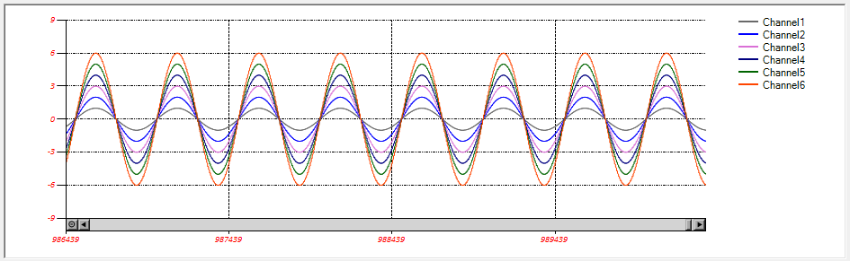

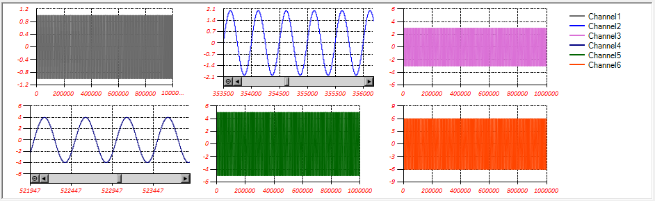

### ViewController

ViewController是一个用来操作界面联动的类，使用切换状态的方式根据当前状态调整界面控件的状态。目前支持操作控件的Enabled(是否使能)和Visible属性(是否可见)。该控件的属性如下所示，其中除了State以外其他属性都是在设计时配置完成的。该控件仅在设计时可见，运行时会自动隐藏。

| **属性**               |                                  |
|------------------------|----------------------------------|
| **属性名称**           | **功能描述**                     |
| StateNames(string[])   | 所有状态名                       |
| State(string)          | 当前状态，不区分大小写           |
| ControlInfos(string[]) | 各个状态的控制信息，无需手动修改 |

ViewController的StateNames和ControlInfos通过ViewController控件的小三角配置。点击后的配置界面如下图所示，详细的使用方法参见范例：SeeSharpExamples/Graphical User Interface/ViewControllerExample。

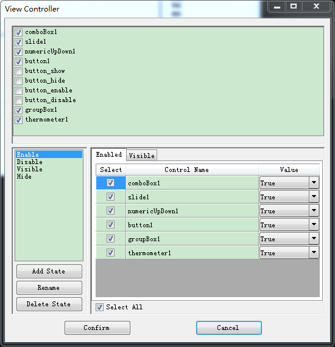

配置状态和联动信息的流程如下：

-   先在最上面的列表中选择需要联动的控件，这些控件会自动同步到下面的表格中

-   左下方添加、重命名或者删除状态。如需配置某个状态的控件属性，点击该状态

-   在右侧对需要操作的控件打勾，然后选择对应的Enabled和Visible的值。Enabled和Visible通过上面的tab页切换

-   配置结束后点击Confirm即可。

使用时可以用类似viewController1.State = “idle”的方法，将idle中配置为不使能或不显示的控件灰化或隐藏。该属性是跨线程安全的，在非UI线程执行时无需调用额外的Invoke。

 SeeSharpTools.JY.Database类库
------------------------------

JY.Database包含1个DbOperation类，其中封装了对常见数据库的通用操作，支持的数据库类型Microsoft SQL Server，Microsoft Access，MySql，Oracle，OleDb，ODBC等，用户无需关注数据库的实际差异，只需要提供对应数据库的连接字符串以及数据库类型，然后使用通用的SQL语句就可以对数据库进行访问。类中的方法如下表所示：

| **方法名**        | **功能概要**                                                                                                                                                                                     |
|-------------------|--------------------------------------------------------------------------------------------------------------------------------------------------------------------------------------------------|
| **DbOperation类** |                                                                                                                                                                                                  |
| ExecuteNonQuery   | 一般用于UPDATE、INSERT和DELETE语句是否操作成功。唯一的返回值是受到命令影响的行数，如果影响行数为0的话，则证明操作是不成功的，大于0则证明操作成功                                                 |
| ExecuteScalar     | 执行查询并返回查询所返回一个结果或者一列，如给定表中的记录个数或者当前服务器时间。返回值为一个对象（object），可以根据需要把对象强制转换为合适的类型。                                           |
| ExecuteDataReader | DataReader（数据读取器）是从数据源中选择某些数据最简单高效的办法，返回的DatReader对象提供了“游标”形式的读取方法，当从结果中读取一行完毕后“游标”会继续读取到下一行，每次调用都会返回一行数据。    |
| ExecuteDataTable  | 执行一个查询命令，返回的DataTable（数据表）对象非常类似于实际物理的数据库表，它由一组特定属性的列组成，可能包含0行或者多行数据。数据表也可以定义主键（可以是一列或者多列），列上也可以包含约束。 |

 SeeSharpTools.JY.Localization类库
----------------------------------

JY.Localization包含一个Localization类，主要用于对WinForms程序实现本地化，在项目中需要结合资源文件来进行使用。类中包含的方法如下：

| **方法名**         | **功能概要**                                                   |
|--------------------|----------------------------------------------------------------|
| **Localization类** |                                                                |
| SetLang            | 读取对应语言的资源文件中信息，对指定窗体的界面实现本地化操作。 |

 SeeSharpTools.JY.DSP.FilterMCR类库
-----------------------------------

JY.DSP.Fundamental包含3个静态类：IIRFilter,
FIRFilter和JYSpectrum，分别提供IIR滤波器，FIR滤波器，频谱计算功能，方法如下表所示：

| **方法名**            | **功能概要**                                                 |
|-----------------------|--------------------------------------------------------------|
| **IIRFilter类/FIR类** |                                                              |
| Initialize            | 预加载类需要调用的函数，加载完成后，首次调用时间会大大缩短。 |
| ProcessLowpass        | 低通滤波器。                                                 |
| ProcessHighpass       | 高通滤波器。                                                 |
| ProcessBandpass       | 带通滤波器。                                                 |
| ProcessBandstop       | 带阻滤波器。                                                 |
| **JYSpectrum类**      |                                                              |
| FFTSpectrum           | 计算输入时域信号的频谱，可设定输出频谱的单位；               |

注意事项：

1.  项目属性-\>调试-\>启用调试器请取消勾选《启用Visual Studio承载进程》。

    1.  SeeSharpTools.JY.DSP.SoundVibration类库

JY.DSP.SoundVibration包含一个HarmonicAnalyzer静态类，主要用于对声音和振动信号的分析和处理。类中包含的方法如下：

| **方法名**             | **功能概要**                                                  |
|------------------------|---------------------------------------------------------------|
| **HarmonicAnalyzer类** |                                                               |
| ToneAnalysis           | 计算输入信号的基波和所有谐波频率和幅度，以及总谐波失真（THD） |

 SeeSharpTools.JY.DSP.Utility类库
---------------------------------

JY.DSP.Utility包含5个静态类：PeakSprectrum、Phase、Synchronizer、ToneAnalysis和SignalProcess类。其中PeakSprectrum类用于检测信号的峰值功率和所在频率点；Phase类用于检测信号的相位信息；Synchronizer类用于对多通道数据的相位进行补偿；ToneAnalysis计算波形的谐波/信噪比等指标；SignalProcess类用于波形的峰值侦测、过零点侦测以及上下限侦测。前三个类中包含的方法如下：

| **方法名**                   | **功能概要**                                                                |
|------------------------------|-----------------------------------------------------------------------------|
| **PeakSpectrum类**           |                                                                             |
| PeakSpectrumAnalysis         | 检测信号的峰值功率和所在频率点                                              |
| **Phase类**                  |                                                                             |
| CalPhaseShift                | 计算波形之间的相位差                                                        |
| **Synchronizer类**           |                                                                             |
| Sync                         | 对多通道数据的相位进行补偿                                                  |
| **HarmonicAnalysis类**       |                                                                             |
| ToneAnalysis                 | 计算输入波形的THD/THD+N/SNR/SNRAD等参数，返回ToneAnalysisResult类型的结果。 |
| CaculateRMSNoiseInTargetBand | 计算波形在指定带宽内噪声的RMS                                               |
| ComponentsLevelCaculation    | 计算波形的THD/峰峰值等指标                                                  |

ToneAnalysisResult类是保存波形指标计算结果的类，各属性如下所示。

| **属性名**               | **功能概要**                                                                                                            |
|--------------------------|-------------------------------------------------------------------------------------------------------------------------|
| **ToneAnalysisResult类** |                                                                                                                         |
| THD                      | 谐波失真                                                                                                                |
| THDPlusN                 | 总谐波失真加噪声                                                                                                        |
| SINAD                    | 交流信号信噪比                                                                                                          |
| SNR                      | 信噪比                                                                                                                  |
| NoiseFloor               | 噪声基底                                                                                                                |
| ENOB                     | 有效位数                                                                                                                |
| **SignalProcess类**      |                                                                                                                         |
| CheckThreshold           | 搜寻波形中超过阈值(threshold)的波峰值/波谷值。                                                                          |
| CrossZeroPoints          | 搜寻波形中爬升超过/下降低于零点的值。返回索引和值的字典                                                                 |
| CheckInRange             | 检测波形中超过范围的值。返回值为长度等于波形长度的List，依照索引保存结果：1为超过上限，-1为低于下限，0为在range范围内。 |

 SeeSharpTools.JY.Graph3D类库
-----------------------------

JY.Graph3D为基于ILNumerics类库(1.4版本)以及ILNumerics.Drawing(0.9版本)实现的自定义控件,开源授权符合LGPL定义

类库中引用了量测常用的Intensity Graph以及Surface Graph等两种图表控件

### Surface Graph 类

Surface Graph 包含的属性以及方法如下表所示

| **属性**              |                                                          |
|-----------------------|----------------------------------------------------------|
| **属性名称**          | **功能描述**                                             |
| AxesLineVisible       | 设定是否在SurfaceGraph中显示轴线标注,默认为True。        |
| BackgroundColor       | 设定SurfaceGraph中绘图区外的背景颜色,默认为White         |
| CubeColor             | 设定SurfaceGraph中绘图区颜色，默认为White                |
| CubeGridVisible       | 设定是否在SurfaceGraph中显示方网格线，默认为false。      |
| WireframeVisible      | 设定是否在SurfaceGraph上显示网格，默认为false。          |
| XAxisTitle            | 设定SurfaceGraph中X轴的标注文字，默认为X。               |
| YAxisTItle            | 设定SurfaceGraph中Y轴的标注文字，默认为Y。               |
| ZAxisTitle            | 设定SurfaceGraph中Z轴的标注文字，默认为Z。               |
| BackColorOfColorBar   | 设定SurfaceGraph中Colorbar的背景颜色,默认为White         |
| BorderStyleOfColorBar | 设定SurfaceGraph中Colorbar的线条类型,默认为FixedSingle   |
| HeightofColorBar      | 设定SurfaceGraph中Colorbar的高度,默认为120               |
| Position              | 设定SurfaceGraph中Colorbar距离左上方的位置点,默认为(5,5) |
| VisibleColorBar       | 设定是否在SurfaceGraph中显示ColorBar，默认为True。       |
| WidthofColorBar       | 设定SurfaceGraph中Colorbar的宽度,默认为120               |
| **方法**              |                                                          |
| **方法名称**          | **功能描述**                                             |
| Plot (double[,])      | 绘制图表(给予2Ddouble数组)                               |
| Plot (stdWfm)         | 绘制图表(使用内嵌的标准数组,Sync以及Waterfall)           |
| Refresh()             | 重新绘制图表                                             |
| ColorBarUpdate()      | 更新ColorBar                                             |

图形绘制完成后,鼠标左键单击可放大检视,右键单击可缩小检视,双击恢复默认大小,鼠标拖曳可改变视角

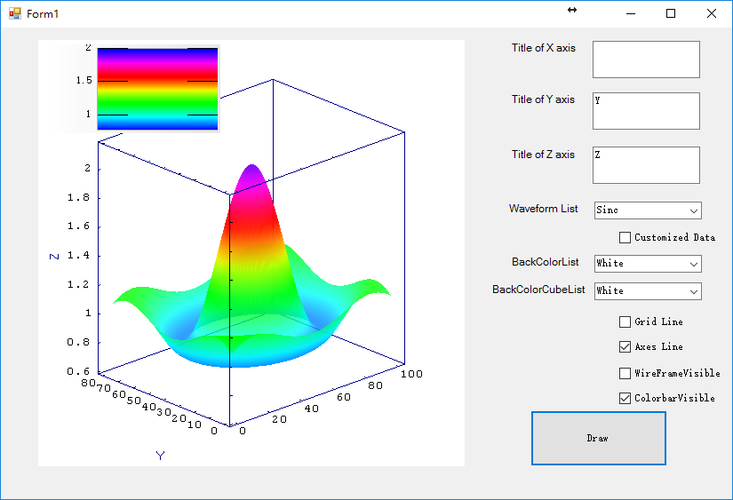

 

### Intensity Graph 类

Intensity Graph 包含的属性以及方法如下表所示

| **属性**              |                                                            |
|-----------------------|------------------------------------------------------------|
| **属性名称**          | **功能描述**                                               |
| AxesLineVisible       | 设定是否在IntensityGraph中显示轴线标注,默认为True。        |
| BackgroundColor       | 设定IntensityGraph中绘图区外的背景颜色，默认为White        |
| WireframeVisible      | 设定是否在IntensityGraph上显示网格，默认为false。          |
| XAxisTitle            | 设定IntensityGraph中X轴的标注文字，默认为X。               |
| YAxisTItle            | 设定IntensityGraph中Y轴的标注文字，默认为Y。               |
| BackColorOfColorBar   | 设定IntensityGraph中Colorbar的背景颜色,默认为White         |
| BorderStyleOfColorBar | 设定IntensityGraph中Colorbar的线条类型,默认为FixedSingle   |
| HeightofColorBar      | 设定IntensityGraph中Colorbar的高度,默认为120               |
| Position              | 设定IntensityGraph中Colorbar距离左上方的位置点,默认为(5,5) |
| VisibleColorBar       | 设定是否在IntensityGraph中显示ColorBar，默认为True。       |
| WidthofColorBar       | 设定IntensityGraph中Colorbar的宽度,默认为120               |
| **方法**              |                                                            |
| **方法名称**          | **功能描述**                                               |
| Plot(double[,])       | 绘制图表(给予2Ddouble数组)                                 |
| Plot(stdWfm)          | 绘制图表(使用内嵌的标准数组,Sync以及Waterfall)             |
| Refresh()             | 重新绘制图表                                               |
| ColorBarUpdate()      | 更新ColorBar                                               |

图形绘制完成后,鼠标左键单击可放大检视,右键单击可缩小检视,双击恢复默认大小,鼠标拖曳可改变视角

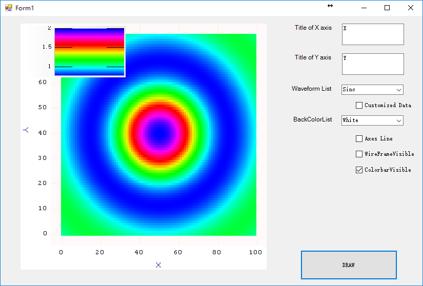

1.  SeeSharpTools.JY.File类库

    1.  AnalogWaveformFile类

JY.File类库中包含了一个AnalogWaveformFile类，提供波形的存储和读取功能，公共属性和方法如下图所示。

| **属性**             |                                                                                                                                                                                                      |
|----------------------|------------------------------------------------------------------------------------------------------------------------------------------------------------------------------------------------------|
| **属性名称**         | **功能描述**                                                                                                                                                                                         |
| FileFormat           | 文件格式，枚举，Stream/Multi-Record。                                                                                                                                                                |
| DataType             | 数据格式，枚举，Int16/Int32/Float/Double。                                                                                                                                                           |
| ByteOrder            | 字节序，枚举，Little Endian/Big Endian。                                                                                                                                                             |
| ArchiveInformation   | 归档信息，见”ArchiveInformation”类说明。                                                                                                                                                             |
| NumberOfChannels     | 通道数。                                                                                                                                                                                             |
| SampleRate           | 采样率，S/s                                                                                                                                                                                          |
| DataLength           | 数据长度，以Sample为单位                                                                                                                                                                             |
| Channels             | 各通道采样信息，包括通道名称、采集量程、换算因子、物理单位名称和备注，List\<ChannelInfo\>列表，见” ChannelInfo”类说明。                                                                              |
| DataStartTime        | 数据起始点时间。                                                                                                                                                                                     |
| TimeLabels           | 时间戳标签序列，可定义一组标签来标识指定数据采样点所在的时间，当文件格式为Stream时可对于长时间连续数据的时间此证，当文件格式为Multi-Record时用于标识个Record的起始点时间信息，见” Timelabel”类说明。 |
| CustomLabels         | 自定义标签序列，可定义一组标签来保存备注信息，见” CustomLabel”类说明。                                                                                                                               |
| EnableWriteBuffering | 是否开启写操作缓存。                                                                                                                                                                                 |
| EnableFastStream     | 是否开启高速读写。                                                                                                                                                                                   |
| **方法**             |                                                                                                                                                                                                      |
| Open                 | 创建新文件或打开文件。                                                                                                                                                                               |
| Close                | 关闭文件。                                                                                                                                                                                           |
| Write                | 写入数据，多态方法，支持多种数据类型(short,int,float,double)。                                                                                                                                       |
| Read                 | 读取数据，多态方法，支持单通道、多通道，以及多种数据类型(short,int,float,double)。                                                                                                                   |
| SetFilePosition      | 读取文件位置，以Sample为单位。                                                                                                                                                                       |
| GetFilePositon       | 获取当前文件读取位置，或已写入的数据长度，以Sample为单位。                                                                                                                                           |
| AddTimeLabel         | 添加时间标签，多态方法。                                                                                                                                                                             |
| GetTimeLabel         | 获取指定时间标签信息。                                                                                                                                                                               |
| AddCustomLabel       | 添加自定义备注，支持Int/Double/String。                                                                                                                                                              |
| GetCustomLabel       | 获取指定自定义标签信息。                                                                                                                                                                             |

ArchiveInformation类定义文件归档信息。

| **属性**           |                          |
|--------------------|--------------------------|
| **属性名称**       | **功能描述**             |
| FileVersion        | 只读，WaveformFile的版本 |
| Author             | 可用于描述数据来源       |
| DataLabel          | 可用于数据的归档标识     |
| DataGroupID        | 可用于文件的关联标识     |
| FileCreatedDate    | 只读，文件建立的时间     |
| GeographicLocation | 可用于描述地理位置信息   |
| Description        | 可用于描述数据备注       |

ChannelInfo类定义通道信息。

| **属性**     |                   |
|--------------|-------------------|
| **属性名称** | **功能描述**      |
| Name         | 通道名称          |
| RangeHigh    | 通道量程上限      |
| RangeLow     | 通道量程下限      |
| Offset       | a of "a + b \* x" |
| Scale        | b of "a + b \* x" |
| Unit         | 单位              |
| Description  | 备注              |

TimeLabel类定义时间标签信息。

| **属性**     |                                          |
|--------------|------------------------------------------|
| **属性名称** | **功能描述**                             |
| Name         | 标签名。                                 |
| Postion      | 样点位置，表示相对于起始样点的样点个数。 |
| Time         | 样点时间。                               |
| Description  | 备注。                                   |

CustomLabel类定义自定义标签信息，并提供获取和修改自定义标签值的方法。

| **属性**     |                                                 |
|--------------|-------------------------------------------------|
| **属性名称** | **功能描述**                                    |
| Name         | 标签名。                                        |
| DataType     | 标签数据格式，枚举，Int16/Int32/Double/String。 |
| **方法**     |                                                 |
| SetValue     | 设置标签值。                                    |
| GetValue     | 获取标签值。                                    |

### BinHandler类

BinHandler类实现从bin文件读取和写入数据的功能，目前支持读写double或string类型的一维或二维数据。

| **方法**       |                                                                                 |
|----------------|---------------------------------------------------------------------------------|
| **方法名称**   | **功能描述**                                                                    |
| ReadData       | 从bin文件中读取数据到二维string数组                                             |
| ReadDoubleData | 从bin文件中读取数据到二维double数组                                             |
| WriteData      | 将一维或二维的string或double数组写入bin文件。可以配置当文件存在时追加还是覆盖。 |

### CsvHandler类

CsvHandler是静态类，实现从csv文件读取和写入数据的功能，目前支持读写string、double、int、uint、short、ushort类型的一维或二维数据。

| **方法**       |                                                                                     |
|----------------|-------------------------------------------------------------------------------------|
| **方法名称**   | **功能描述**                                                                        |
| ReadData       | 从csv文件中读取数据到二维string数组                                                 |
| ReadDoubleData | 从csv文件中读取数据到二维double数组                                                 |
| ReadIntData    | 从csv文件中读取数据到二维int数组                                                    |
| ReadUIntData   | 从csv文件中读取数据到二维uint数组                                                   |
| ReadShortData  | 从csv文件中读取数据到二维short数组                                                  |
| ReadUShortData | 从csv文件中读取数据到二维ushort数组                                                 |
| WriteData      | 将一维或二维的string或double数组写入csv文件。可以配置当文件存在时数据追加还是覆盖。 |

以上读取的所有方法有多个重载，支持配置读取的其实行、起始列/读取列索引的数组

### IniHandler类

IniHandler类是静态类，实现对ini文件的操作。有6个调用接口，前四个主要用于整个ini文件的读写改操作，后两个方法适用于单个键值对的读写操作。每个方法的说明如下所示：

| **方法**     |                                                                                         |
|--------------|-----------------------------------------------------------------------------------------|
| **方法名称** | **功能描述**                                                                            |
| ReadIniFile  | 从ini文件中读取数据，返回IniData数据结构                                                |
| WriteIniFile | 将IniData数据写入文件                                                                   |
| MergeIniData | 将两个IniData数据合并，写入第一IniData                                                  |
| MergeToFile  | 将IniData中的数据合并到某个文件的IniData，并写入原文件                                  |
| Read         | 读取Ini文件中所有的Section名称；某个Section下所有的Key；某个Section下某个Key对应的Value |
| Write        | 向Ini文件中的某个Section添加或者键值对或者修改某个Key对应的值                           |

IniHandler中涉及到三个数据类型，使用说明如下：

| **数据类型** |                                              |                                                              |
|--------------|----------------------------------------------|--------------------------------------------------------------|
| **类**       | **功能描述**                                 |                                                              |
| IniData      | 保存ini文件数据结构的类                      |                                                              |
|              | Sections                                     | 所有分区数据的集合，可以使用foreach遍历                      |
|              | Global                                       | 所有全局键值对的集合                                         |
|              | Sections.AddSection(string sectionName)      | 添加空白分区                                                 |
|              | Sections.AddSection(SectionData sectionData) | 添加已有分区                                                 |
|              | Sections.ContainsSection(string sectionName) | 是否包含某个名称的分区                                       |
|              | Sections.RemoveSection(string sectionName)   | 删除某个分区                                                 |
|              | Sections[string sectionName]                 | 获取某个名称的SectionData                                    |
| Section      | 保存单个分区数据的类                         |                                                              |
|              | SectionName                                  | 获取或配置分区的名称                                         |
|              | Keys                                         | 保存键值对数据的集合，可使用foreach遍历                      |
|              | Keys.AddKey(string key, string value)        | 添加一个键值对                                               |
|              | Keys.RemoveKey(string key)                   | 删除一个键值对                                               |
|              | Keys.ContainsKey(string key)                 | 是否包含某个键值对                                           |
|              | Keys[string keyName]                         | 获取该键对应的值，可以使用Key[key]=value修改某个键值对的名称 |
| KeyData      | 保存单个键值对数据的类                       |                                                              |
|              | KeyName                                      | 键值对的键                                                   |
|              | Value                                        | 键值对的值                                                   |

SeeSharpTools.JY.Report类库
---------------------------

JY.DSP.Report包含2个类：WordReport和ExcelReport，分别提供Word报表创建，Excel报表生成：

### WordReport类

| **WordReport类**       |                                                          |
|------------------------|----------------------------------------------------------|
| **属性名**             | **功能概要**                                             |
| DefaultFont            | 默认配置的Word文字格式，包含字型、颜色、粗体、斜体、底线 |
| **方法名**             | **功能概要**                                             |
| Close                  | 关闭Word引擎                                             |
| SaveAs                 | 另存档案                                                 |
| Show                   | 显示Word程序                                             |
| Hide                   | 隐藏Word程序在背景执行                                   |
| WriteTextToDoc         | 写入文字                                                 |
| WriteTableToDoc        | 写入Table表格                                            |
| InsertGraph            | 写入图表                                                 |
| InsertPicture          | 写入图片                                                 |
| ExecuteMacroFromScript | 运行宏                                                   |

### ExcelReport类

| **ExcelReport类**      |                                                            |
|------------------------|------------------------------------------------------------|
| **属性名**             | **功能概要**                                               |
| DefaultFont            | 默认配置的Excel文字格式， 包含字型、颜色、粗体、斜体、底线 |
| **方法名**             | **功能概要**                                               |
| Hide                   | 隐藏Excel程序在背景执行                                    |
| Show                   | 显示Excel程序                                              |
| SaveAs                 | 另存档案                                                   |
| Close                  | 关闭Excel引擎                                              |
| RCToString             | 将Excel中行列数字转换成行列字符串                          |
| StringToRC             | 将Excel中行列字符串转换成行列数字                          |
| LetterToInt            | 字符串转换成Excel数字                                      |
| IntToLetter            | 数字转换成Excel字符串                                      |
| WriteTextToReport      | 写入文字                                                   |
| WriteTableToReport     | 写入表格                                                   |
| WriteListToReport      | 写入清单                                                   |
| InsertGraph            | 写入图表                                                   |
| WriteArrayToReport     | 写入数组                                                   |
| AppendRow              | 接续行写入                                                 |
| AppendColumn           | 接续列写入                                                 |
| ReadSingleCell         | 读取单一cell单元                                           |
| ReadConsecutiveCells   | 读取连续cell单元                                           |
| ReadRegionCells        | 读取指定区间的cell单元                                     |
| ReadCurrentSheet       | 读取当前工作分页                                           |
| ReadSheet              | 读取指定工作分页                                           |
| ReadAllSheets          | 读取所有工作分页                                           |
| ExecuteMacroFromScript | 运行宏                                                     |

### Logger类

Logger类是一个线程安全的静态日志类，当前版本支持记录日志到单个文件或者到某个目录下。Logger类的方法和属性如下：

| **Logger类**              |                                                                                                                                                  |
|---------------------------|--------------------------------------------------------------------------------------------------------------------------------------------------|
| **静态属性名**            | **功能说明**                                                                                                                                     |
| LogLevel (LogLevel枚举)   | 配置和获取当前日志的记录级别，包括Trace/ Debug/ Info/ Warn/ Error/ Fatal，日志级别依次升高。记录时低于LogLevel级别的日志信息不会被记录到日志中。 |
| LogConfig (LogConfig类)   | LogConfig类类型，保存Logger的配置数据。                                                                                                          |
| Enabled(bool)             | 配置是否启用日志记录功能。                                                                                                                       |
| **静态方法名**            | **功能概要**                                                                                                                                     |
| Initialize                | 初始化日志，可以入参日志文件路径(单文件日志)和配置类LogConfig                                                                                    |
| Print                     | 以指定的日志级别打印日志，包含多个重载                                                                                                           |
| Trace                     | 以Trace级别写入日志                                                                                                                              |
| Debug                     | 以Debug级别写入日志                                                                                                                              |
| Info                      | 以Info级别写入日志                                                                                                                               |
| Warn                      | 以Warn级别写入日志                                                                                                                               |
| Error                     | 以Error级别写入日志                                                                                                                              |
| Fatal                     | 以Fatal级别写入日志                                                                                                                              |
| StackTrace                | 以指定级别写入当前的堆栈信息，默认为Debug                                                                                                        |
| ThreadInfo                | 以指定级别写入当前的线程信息，默认为Debug                                                                                                        |
| Close                     | 关闭当前日志记录会话。                                                                                                                           |
| **LogConfig类**           |                                                                                                                                                  |
| **属性名**                | **功能说明**                                                                                                                                     |
| Type(LogType枚举)         | 日志类型，目前只支持FileLog，即文件日志                                                                                                          |
| FileLog (FileLogConfig类) | 文件日志类型的配置类                                                                                                                             |
| LogFormat(string)         | 日志打印的format，{0}为日志级别、{1}为时间戳、{2}为日志信息，默认为”[{0}] [{1}] {2}”，打印效果如：                                               |
| ExceptionFormat(string)   | 日志打印的异常信息的format，{0}为日志级别、{1}为时间戳、{2}为异常类型、{3}为异常信息。                                                           |
| StackTraceFormat(string)  | 日志打印时堆栈信息的format，{0}是打印信息                                                                                                        |
| ThreadInfoFormat(string)  | 日志打印时线程信息的format，{0}是线程ID、{1}是线程名称                                                                                           |
| TimeStampFormat(string)   | 时间戳格式，默认为：yyyy-MM-dd hh:mm:ss:fff                                                                                                      |
| Header(string)            | 日志头                                                                                                                                           |
| **FileLogConfig类**       |                                                                                                                                                  |
| **属性名**                | **功能说明**                                                                                                                                     |
| Extension(string)         | 文件扩展名，默认为log                                                                                                                            |
| LogMode(FileLogMode枚举)  | 日志模式，包括单文件日志和目录日志                                                                                                               |
| Path(string)              | 日志文件路径或文件目录                                                                                                                           |
| LogNameFormat(string)     | 目录日志模式时日志文件名时间的format，默认为： yyyy-MM-dd hh-mm-ss                                                                               |
| MaxLogSize(long)          | 文件的最长字节数，默认为100M，超过该值后：单文件日志清空文件写入；目录日志新建日志文件写入                                                       |
| Encode(Encoding类)        | 编码格式，默认为Unicode                                                                                                                          |
| Flush(FlushType枚举)      | 文件刷新模式：SyncFlush(同步刷新)、AsyncFlush(异步刷新)                                                                                          |

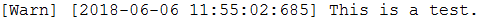

SeeSharpTools.JY.ThreadSafeQueue类库
------------------------------------

该类库包含线程安全的队列组件。

### ThreadSafeQueue类

ThreadSafeQueue是基于Queue开发的线程安全的队列，可以保存数据的引用(非值拷贝)，所有数据都以object类型保存在队列中，在出队后仍为object类型，如果读写非object数据时需要类型强转。该队列在容量不够时会自动扩展。

| **FileLogConfig类** |                      |
|---------------------|----------------------|
| **方法名**          | **功能描述**         |
| Clear               | 清空队列             |
| Enqueue             | 数据入列(对象的引用) |
| Dequeue             | 数据出列             |

### CircularQueue类

CircularQueue是基于数组开发的线程安全队列，使用泛型实现，可以支持保存除了string以外的对象，保存数据时会进行值拷贝。该队列的大小在构造时已经确定，为了保证不溢出，初始化时可以根据单次写入数据的多少，配置为一个较大的数值。同时该对象实现了IList接口，可以对保存在队列中的数据进行随机读写。

| **CircularQueue类** |                                                      |
|---------------------|------------------------------------------------------|
| **属性名**          | **功能描述**                                         |
| Count(int)          | 获取队列中数据的个数                                 |
| Capacity(int)       | 获取队列能容纳的最多元素个数，该参数在构造方法里赋值 |
| AutoLock(bool)      | 是否使用悲观锁(即自动获取操作的锁)，默认为true       |
| BlockWait(bool)     | 读取数据时，如果数据不够是否阻塞读取线程，默认为true |
| **方法名**          | **功能描述**                                         |
| Clear               | 清空队列。                                           |
| Enqueue             | 数据入列。如果获取锁超时，抛出异常                   |
| TryEnqueue          | 数据入列。如果获取锁超时，返回false，否则返回true    |
| Dequeue             | 数据出列，如果获取锁超时，抛出异常                   |
| TryDequeue          | 数据出列，如果获取锁超时，返回false，否则返回true    |
| Enter               | 乐观锁模式下获取操作队列的锁，超时抛出异常           |
| TryEnter            | 乐观锁模式下获取操作队列的锁，超时返回false          |
| Leave               | 乐观锁模式下释放操作队列的锁。                       |

SeeSharpTools.JY.Sensors 类库
-----------------------------

SeeSharpTools.JY.Sensors类库包含6种传感器计算类型，能够将采集到的值转换成传感器的物理量。

### CustomScaling类

| **CustomScaling类** |                                 |
|---------------------|---------------------------------|
| **方法名**          | **功能描述**                    |
| Convert             | 自定义Func\<double,double\>函数 |

### DisplacementSensor类

| **DisplacementSensor类** |                  |
|--------------------------|------------------|
| **方法名**               | **功能描述**     |
| Convert                  | 电阻式位移传感器 |

### LoadCell类

| **LoadCell类** |              |
|----------------|--------------|
| **方法名**     | **功能描述** |
| Convert        | 荷重元传感器 |

### RTD类

| **RTD类**  |               |
|------------|---------------|
| **方法名** | **功能描述**  |
| Convert    | RTD温度传感器 |

### Thermistor类

| **Thermistor类** |                |
|------------------|----------------|
| **方法名**       | **功能描述**   |
| Convert          | 热敏电阻传感器 |

### Thermocouple类

| **Thermocouple类** |                                           |
|--------------------|-------------------------------------------|
| **方法名**         | **功能描述**                              |
| Convert            | 热电偶温度传感器（支持B,E,J,K,N,R,S,T型） |

SeeSharpTools.JY.Statistics 类库
--------------------------------

JY. Statistics类库包含常用的统计功能共9中功能，整合Math.NET类库以及针对Intel CPU优化的高效能类库Intel IPP库（透过简单属性修改计算核心类别来切换）。

如果需要使用IntelIPP库，须上网下载、安装Intel IPP类库。将dll按照运行平台不同分成ia32和intel64的文件夹， 放在与SeeSharpTools.JY.Statistics.dll同个目录下，如下图所示

..\\NativeDLLs\\ia32\\ 32位dll

..\\NativeDLLs\\intel64 64位dll

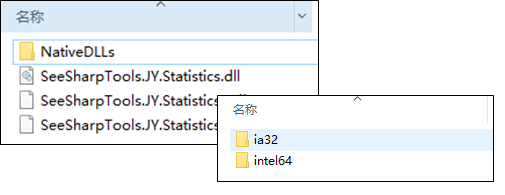

| **Engine类**      |                                      |
|-------------------|--------------------------------------|
| **属性**          | **功能描述**                         |
| Provider          | 选择运行引擎使用Math.NET或是IntelIPP |
| **Statistics类**  |                                      |
| **方法名**        | **功能描述**                         |
| Histogram         | 画出数组统计直方图                   |
| Kurtosis          | 计算出Kurtosis值                     |
| Maximum           | 计算出Maximum值                      |
| Mean              | 计算出Mean值                         |
| Minimum           | 计算出Minimum值                      |
| RMS               | 计算出RMS值                          |
| Skewness          | 计算出Skewness值                     |
| StandardDeviation | 计算出StandardDeviation值            |
| Variance          | 计算出Variance值                     |

SeeSharpTools.JY.TCP 类库
-------------------------

JY.TCP类库包含两个类：JYTCPServer以及JYTCPClient类库。

| **JYTCPServer类** |                          |
|-------------------|--------------------------|
| **属性名**        | **功能概要**             |
| AvailableSamples  | 返回对象缓存中的数目     |
| BufferSize        | 缓存大小                 |
| IsClientConnect   | 判定是否有客户端连接成功 |
| **方法名**        | **功能概要**             |
| Start             | 开始任务                 |
| Stop              | 停止任务                 |
| ReadData          | 读取资料                 |
| SendData          | 送出资料                 |
| **JYTCPClient类** |                          |
| **属性名**        | **功能概要**             |
| AvailableSamples  | 返回对象缓存中的数目     |
| BufferSize        | 缓存大小                 |
| Connected         | 判定是否连接成功         |
| **方法名**        | **功能概要**             |
| Connect           | 开始连接                 |
| DisConnect        | 终止连接                 |
| ReadData          | 读取资料                 |
| SendData          | 送出资料                 |

常见问题解答
============

如在使用中遇到其它问题，请联系上海简仪科技有限公司。我们的联系邮箱：[mailto:support\@jytek.com](mailto:support@jytek.com)
